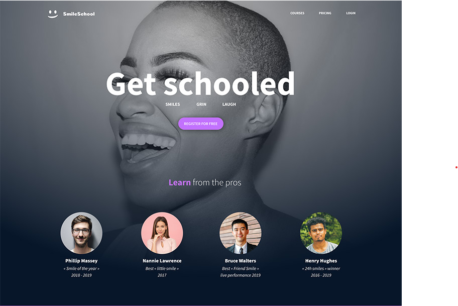
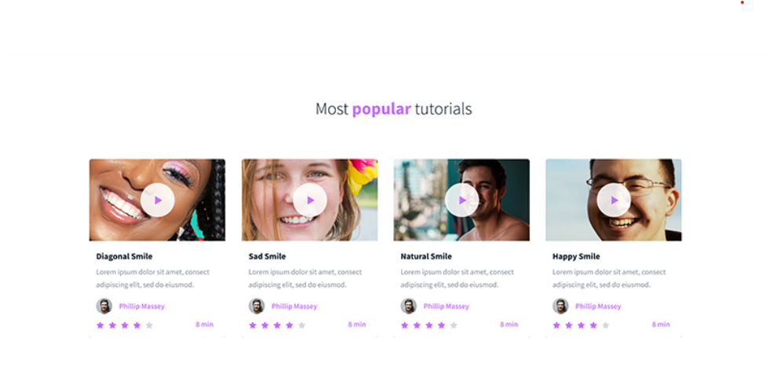
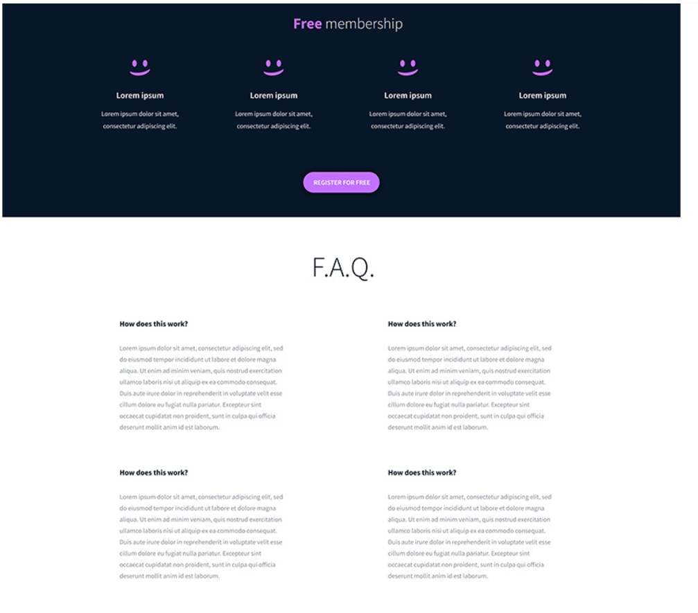

# SmileSchool Landing Page Clone

## Project Description
This project is a **frontend clone of the SmileSchool landing page** based on a provided design mockup.  
The goal of the project was to recreate the layout and visual appearance of the webpage using **HTML and CSS only**, following the structure given and styling it to closely match the reference images.

This project focuses on:
- HTML semantic structure
- CSS layout and styling
- Flexbox positioning
- Visual consistency with a design mockup

---

## Screenshots

### Homepage – Hero Section

### Tutorials Section

### Free Membership & FAQ

>  *Screenshots are taken from the completed webpage.*

## Built With
- HTML5
- CSS3
- Font Awesome (for icons)

## Getting Started

To view this project locally:

1. Clone the repository or download the files
2. Make sure all image assets are in the correct folders
3. Open `index.html` in your browser

No additional setup is required.

## Author
**Adwoa Daki**

Frontend Development Student  